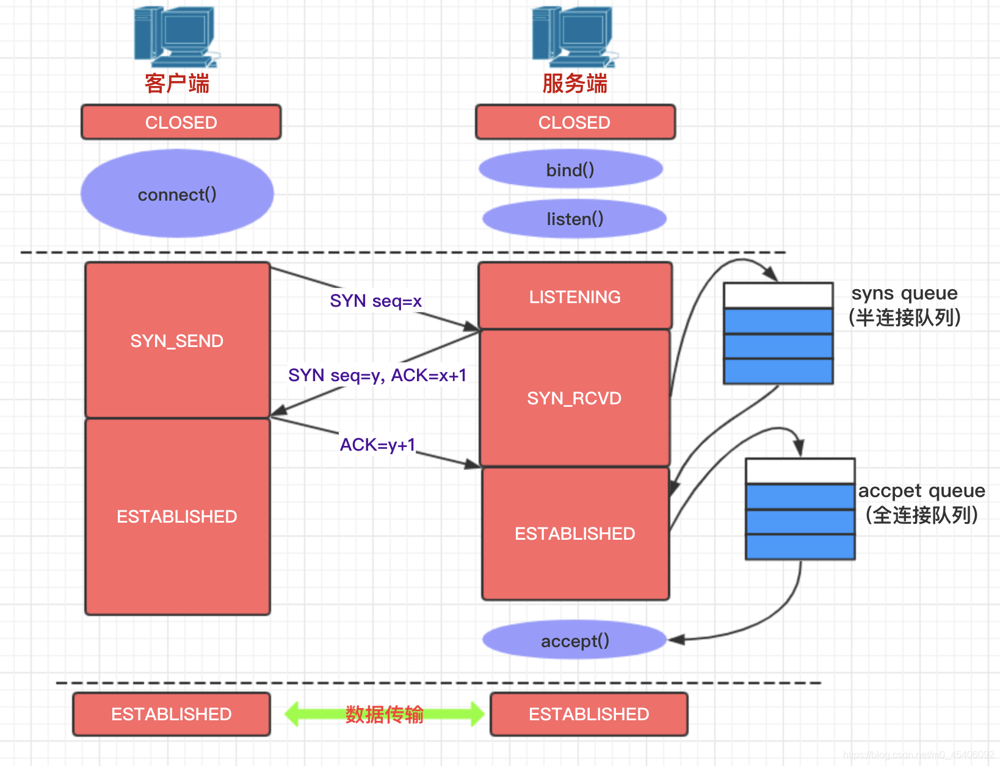
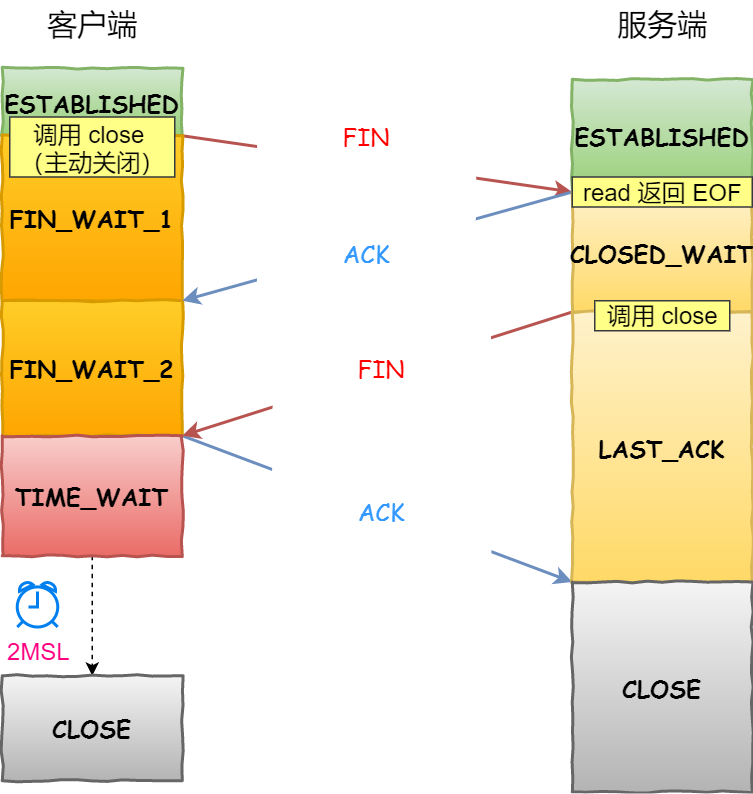

# linux 网络问题排查

### TCP

#### backlog
TCP通讯是可靠的通讯方式,可靠是通过面向连接来实现的.也就是说双方需要维护一定的数据结构来保证面向连接.
TCP通讯在创建连接时有两个数据结构:
```
半连接队列(SYN queue),全连接队列(accept queue)
```

从TCP的三次握手说起,
第一次客户端发送SYN到服务端,服务端会将这个连接保存在```SYN queue```这个队列,
服务端返回SYN ACK给客户端,
客户端收到ACK后,在发送ACK给服务端,服务端会将这个连接保存在```accept queue```,同时移除```SYN queue```中的记录


在这个过程中可能存在``` SYN queue 或者 accept queue```队列已满的情况,我们在创建TCP连接时backlog其实就是```accept queue```队列长度.
相关的Linux系统参数有:
```ini
#accept queue队列长度,最终取somaxconn,backlog中的最小值生效
#/proc/sys/net/core/somaxconn
somaxconn

#accept queue队列满后,后续连接处理方式,默认为0,丢弃,等待客户端重试
#/proc/sys/net/ipv4/tcp_abort_on_overflow
tcp_abort_on_overflow

#SYN queue队列长度
tcp_max_syn_backlog

#SYN超时重传次数
#/proc/sys/net/ipv4/tcp_syn_retries
tcp_syn_retries

#SYN ACK超时重传次数
#/proc/sys/net/ipv4/tcp_synack_retries
tcp_synack_retries
```
- backlog队列溢出

    内核中记录了两个计数器：
    
    ListenOverflows：当 socket 的 listen queue 已满，当新增一个连接请求时，应用程序来不及处理；
    
    ListenDrops：包含上面的情况，除此之外，当内存不够无法为新的连接分配 socket 相关的数据结构时，也会加 1，当然还有别的异常情况下会增加 1。
    
    分别对应下面文件中的第 21 列（ListenOverflows）和第 22 列（ListenDrops），可以通过如下命令查看：
    
    ```shell
    cat /proc/net/netstat | awk '/TcpExt/ { print $21,$22 }'
    ```
    也可以用命令
    ```shell
    netstat -s | grep overflowed
    ```
    查看accept queue队列长度
    ```shell
    ss -lnt|grep port
    ```
- SYN queue队列溢出
  可以用命令```netstat -s |grep "SYNs to LISTEN"```来查看,但是如果要调整,accept queue也要调整
  
#### 四次挥手

从图中可以看出,若服务器主动关闭连接,在四次挥手之后端口会变为TIME_WAIT状态,状态停留时
长为2MSL,这个状态只有在主动关闭连接方出现,另一端在连接断开后立刻投入使用.

```MSL```是一个TCP分段可以存在于互联网系统中的最大时长,RFC 793指出MSL为2分钟,
但在LINUX系统中一般为30s,通过下面这个命令可以确定一些LINUX系统上的MSL数值:
```ini
#/proc/sys/net/ipv4/tcp_fin_timeout
tcp_fin_timeout 60
```

TIME_WAIT状态限制是比较严格的,设置TIME_WAIT状态主要有两个目的:
- 防止一个连接的延迟分段被后面新建的连接接收
- 确保远程端已关闭连接

大量的TIME_WAIT状态连接会占用文件句柄(FD),如果超过fd上限,后续连接就无法建立.解决方案如下:
- 修改```/proc/sys/net/ipv4/ip_local_port_range```,增加更多的可用端口
- 在不同的机器上边部署更多的应用

还有一些修改系统参数的解决方案,但是有一些风险.
```ini
#客户端有用,前提条件是/proc/sys/net/ipv4/tcp_timestamps不为0
#/proc/sys/net/ipv4/tcp_tw_reuse
tcp_tw_reuse
```
查看tcp连接统计信息,可关注一下TIME_WAIT状态下的连接数
```shell
netstat -an|awk '/tcp/ {print $6}'|sort|uniq -c
```
#### 数据传输


#### 查看丢包
- 操作系统处理不过来
```shell
cat /proc/net/dev
```
每个网络接口一行统计数据,第 4 列（errs）是接收出错的数据包数量,第 5 列（drop）是接收不过来丢弃的数量.

- 应用程序处理不过来
```shell
cat /proc/net/netstat | awk '/TcpExt/ { print $21,$22 }'
```

这里主要查看半连接队列和全连接队列是否已满

- 内存不足

查看内存分配
```shell
cat /proc/sys/net/ipv4/tcp_mem
```

查看内存使用了多少
```shell
cat /proc/net/sockstat
```